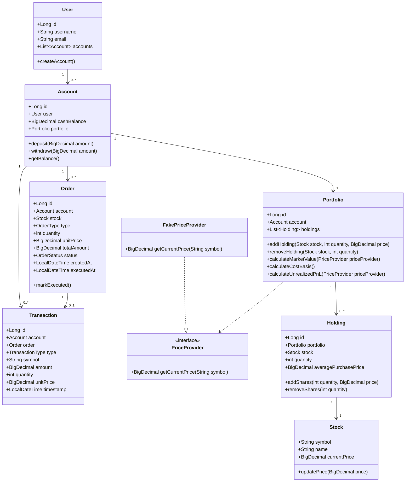

# 04. Domain Model

## 1. Design choice

The project uses a simple but realistic domain model:

- User represents the person or actor.
- Account represents the cash account and fund movements.
- Portfolio represents the set of holdings owned by an account.
- Holding represents a position in a stock.
- Stock represents the underlying traded asset.
- Order represents the intent to buy or sell.
- Transaction represents the completed financial event.
- PriceProvider is a domain abstraction for market data.

This is the simplest design that preserves the important business distinctions without overengineering.

## 2. Why these concepts are included

### User
A User is separate from Account because a person can own multiple accounts in the future and because user identity and account ownership should not be mixed together.

### Account
An Account owns money and is responsible for cash validation. It should not be the place where all business logic lives, because that would mix balance management, trading workflows, and portfolio calculations into one class.

### Portfolio
A Portfolio is a separate concept because it contains holdings and is used to calculate market value and profit/loss. The account owns the cash, but the portfolio owns the positions.

### Holding
A Holding is not a Stock. A Stock is the asset itself. A Holding is the account’s ownership of that asset.

### Order vs Transaction
- Order = request or instruction to trade.
- Transaction = actual execution and financial impact.
This distinction matters because a request can exist without execution, and an execution must be recorded as a financial event.

## 3. Core entities and relationships

## 4. Important relationship analysis

### Account → Portfolio
This is a good design because the account owns cash and the portfolio holds investments. They are tightly related but have different responsibilities.

### Portfolio → Holding
A portfolio is a collection of holdings. This is a natural 1-to-many relation.

### Holding → Stock
A holding is always linked to an underlying stock. A holding is not the stock itself; it is the ownership record.

### Account → Order
Each order is associated with the account placing it.

### Account → Transaction
Each executed trade or funding event belongs to an account.

## 5. Aggregates and boundaries

### Aggregate: Account
For version 1, the Account is the aggregate root. It owns its cash balance, its portfolio, and the associated order/transaction history.

This is practical because the main invariant is account solvency and consistency of cash with trades.

### Aggregate: Stock
A Stock is a reference entity. It represents an asset with a price, but it is not the same as a position.

### Not a separate aggregate in version 1
- User is not an aggregate root for the trading logic; it is a person identity owner.
- Portfolio is modeled as a strong concept but is best treated as part of the account aggregate boundary in this project.

## 6. Entities vs value objects

### Entities
- User
- Account
- Portfolio
- Holding
- Stock
- Order
- Transaction

These have identity and lifecycle.

### Value objects
For version 1, we are intentionally keeping the design lean. Instead of introducing a full Money value object or Quantity value object, we use:
- BigDecimal for currency and prices
- int for share quantity

This keeps the project simple and professional without creating unnecessary abstractions.

### Domain services
- TradingService: coordinates buy and sell workflows.
- PortfolioService: calculates market value and P/L.
- PriceProvider: abstraction for market price access.

These services are used when behavior crosses multiple aggregates and should not be shoved into a single Account class.

## 7. Repository abstractions

The domain layer can define repository interfaces such as:
- UserRepository
- AccountRepository
- StockRepository
- OrderRepository
- TransactionRepository

These interfaces are implemented in the infrastructure layer with PostgreSQL access code.

## 8. Validation and exceptions

Validation belongs in the domain and application layers, not in persistence or presentation. Examples:
- InvalidQuantityException
- InvalidPriceException
- InsufficientFundsException
- InsufficientSharesException
- StockNotFoundException
- AccountNotFoundException

These domain exceptions make business failures explicit and testable.

## 9. Money and quantity decisions

### Money
Use BigDecimal for:
- account balance
- stock price
- order value
- transaction amount
- average purchase price
- cost basis and P/L

### Quantity
Use int for share quantities in version 1. This is sufficient for the simplified platform and avoids complexity around fractional share support.

If fractional shares become a requirement later, the quantity field can be migrated to BigDecimal or a specialized Quantity value object.

## 10. Summary

The domain model is intentionally small and professional:
- User owns accounts.
- Account owns cash and a portfolio.
- Portfolio manages holdings.
- Stock is the asset definition.
- Holding is the user’s ownership record.
- Order expresses intent.
- Transaction records execution.
- PriceProvider abstracts market data.

This cleanly supports the required trading workflows without creating unnecessary microservices or overengineered design patterns.
