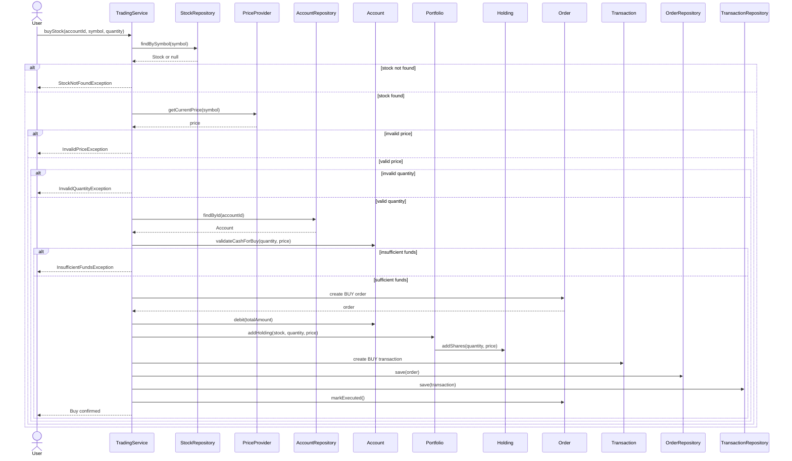

# 05. Buy Stock Sequence

## Notes

- The price is retrieved from a `PriceProvider` abstraction.
- Validation happens before cash is deducted.
- The total order value is calculated as quantity × unit price.
- The holding is created or updated using the stock and purchase price.
- Execution is persisted as both an `Order` and a `Transaction`.
