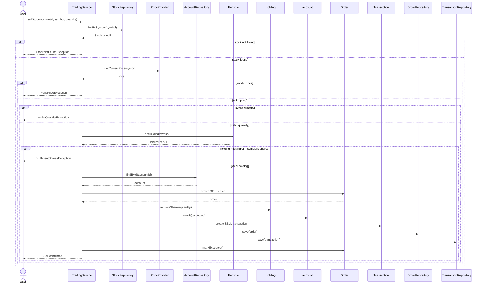

# 06. Sell Stock Sequence

## Notes

- The system verifies that the holding exists and has enough shares before execution.
- The holding quantity is reduced after validation passes.
- The account receives the sale proceeds at the current market price.
- The sell order and the sell transaction are both recorded for audit and reporting.
